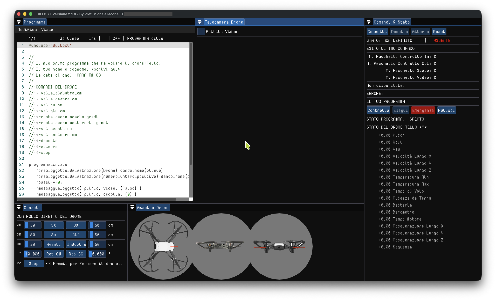

# STEM CAPSULA

<p align="center">

</p>

<p align="center">
<b>Costruzione di Idee e di Complessi di Senso.</b>
</p>

---

# Cosa è STEM Capsula

<p align="justify">
Un luogo di lavoro condiviso per tutti coloro che vogliano cimentarsi nella costruzione di idee e di complessi di senso, nel perimetro appena visibile di Scienza, Tecnologia, Engineering e Matematica, con il prezioso aiuto dell'informatica e la ricchezza e libertà espressiva dell'Arte. Non c'è cosa più difficile che comunicare con gli umani. Non si è mai certi di aver costruito il discorso secondo una struttura di senso che sia inequivocabile, comprensibile, criticabile. Pur tuttavia, questo è lo sforzo che siamo chiamati a fare. I ragazzi possono, vogliono, devono imparare a organizzare le parole e le frasi, organizzare i numeri, organizzare i simboli più complessi, organizzare le azioni del corpo, organizzare la voce e il canto, organizzare il pensiero. Tutto nel linguaggio e nel pensiero è una continua cascata di analogie... 
</p>

---

# I PROGETTI ATTIVI

---

# DILLO XL (pensiero computazionale applicato)

<p align="center">

</p>

## Abstract

<p align="justify">
**DILLO XL** è prima di tutto un linguaggio didattico, il cui obiettivo è mettere gli studenti nelle condizioni di familiarizzare con il paradigma COMANDANTE/ESECUTORE tipico dei linguaggi di programmazione imperativi, in cui un comandante (l'umano) istruisce una macchina (l'esecutore), con il fine di fargli raggiungere un determinato obiettivo (o insieme di obiettivi) sulla base di una sequenza di istruzioni (un programma). Per ottenere questo obiettivo, DILLO XL sfrutta un meccanismo elementare: fornisce un insieme di primitive per pilotare un drone volante **TELLO EDU** della *Ryze Robotics* (ora DJI). Nello specifico, **DILLO XL** è alla fine un ambiente di sviluppo di software nel linguaggio *DILLO*, per controllare un drone volante ed, indirettamente, imparare sequenze, ripetizioni e selezioni, variabili e costanti, primitive matematiche e tecniche di controllo (seppur elementari) di sistemi di sensori/attuatori. Esso fornisce un doppio livello di indirezione: comandante -> esecutore (computer personale) che comanda -> drone (computer embedded).
</p>

| Problema | Soluzione | Tecnologie |
|----------|-----------|------------|
| ... | ... | ... |

### Approfondimento

<p align="justify">
  *+DILLO XL** è rilasciato secondo una licenza opensource GPL ed è disponibile nel branch devel di questo repository, all'interno della cartella Progetti. È scritto in C++17 ed è multi piattaforma, cioè il suo sorgente compila e viene eseguito su Windows, Linux e macOS, dunque è un sorgente scritto per essere portabile. Il progetto si basa sul sistema di meta-build CMake e può essere compilato su Windows all'interno di MSYS-UCRT64, su Linux (mediante GCC) e su macOS (mediante Clang). Qui sotto un tipico sorgente *DILLO*:
</p>

'''cpp
	/* <<<<<<<<<<<<<<<<<<<<<<<<<<<<<<<<<<<<<<<<<<<<<<<<<<<<<<<<<<<<<<<<<<<<<<<<<
	 * DILLO EXTRA LARGE - DILLOXL
	 * (C) 2024 Copyright by Michele Iacobellis
	 * A project for students...
	 * 
	 * This file is part of DILLOXL.
	 *
	 * DILLOXL is free software: you can redistribute it and/or modify
	 * it under the terms of the GNU General Public License as published by
	 * the Free Software Foundation, either version 3 of the License, or
	 * (at your option) any later version.
	 *
	 * DILLOXL is distributed in the hope that it will be useful,
	 * but WITHOUT ANY WARRANTY; without even the implied warranty of
	 * MERCHANTABILITY or FITNESS FOR A PARTICULAR PURPOSE.  See the
	 * GNU General Public License for more details.
	 *
	 * You should have received a copy of the GNU General Public License
	 * along with DILLOXL. If not, see <http://www.gnu.org/licenses/>.
	 * 
	 * <<<<<<<<<<<<<<<<<<<<<<<<<<<<<<<<<<<<<<<<<<<<<<<<<<<<<<<<<<<<<<<<<<<<<<<<< */
	#include "dilloxl"
    
	//
	// Il mio primo programma che fa volare il drone Tello.
	// Il tuo nome e cognome: <scrivi qui>
	// La data di oggi: AAAA-MM-GG
	//
	programma_inizio
		crea_oggetto_da_astrazione(Drone) dando_nome(plinio)
		crea_oggetto_da_astrazione(numero_intero_positivo) dando_nome(passi)
		passi = 0;
		messaggia_oggetto( plinio, decolla, (0) )
		fai_questo_finche_e_vero_che(passi < 3)
			messaggia_oggetto( plinio, vai_avanti_cm, (50))
			passi = passi + 1;
		fine_questo
		passi = 0;
		fai_questo_finche_e_vero_che(passi < 3)
			messaggia_oggetto( plinio, vai_indietro_cm, (50))
			passi = passi + 1;
		fine_questo
		messaggia_oggetto( plinio, ruota_senso_orario_gradi, (90) )
		messaggia_oggetto( plinio, ruota_senso_antiorario_gradi, (90) )
		messaggia_oggetto( plinio, vai_a_sinistra_cm, (50) )
		messaggia_oggetto( plinio, vai_a_destra_cm, (50) )
		messaggia_oggetto( plinio, vai_su_cm, (50) )
		messaggia_oggetto( plinio, vai_giu_cm, (50) )
		messaggia_oggetto( plinio, atterra, (0) )
	programma_fine
'''

<p align="center">
➡ **Apri il progetto**
</p>

---

# LCG (Lezioni di Computer Grafica)

<p align="center">

</p>

## Abstract

<p align="justify">

...

</p>

| Problema | Soluzione | Tecnologie |
|----------|-----------|------------|
| ... | ... | ... |

### Approfondimento

<p align="justify">

...

</p>

<p align="center">

➡ **Apri il progetto**

</p>

---

# STEMCAPSULA-X (Laboratorio 2D/3D)

<p align="center">

</p>

## Abstract

<p align="justify">

...

</p>

| Problema | Soluzione | Tecnologie |
|----------|-----------|------------|
| ... | ... | ... |

### Approfondimento

<p align="justify">

...

</p>

<p align="center">

➡ **Apri il progetto**

</p>

---

# Tecnologie

<p align="center">

| Linguaggio | Framework | Utilizzo |
|------------|-----------|----------|
| ... | ... | ... |

</p>

---

# Struttura del repository

```
/
│
├── project1/
├── project2/
├── project3/
├── images/
├── docs/
└── README.md
```

---

# Roadmap

- [ ] ...
- [ ] ...
- [ ] ...

---

# Contatti

...
